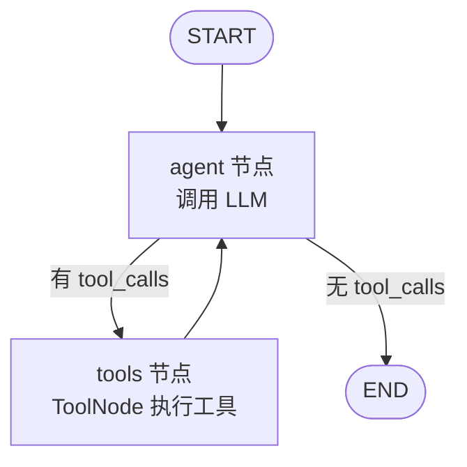
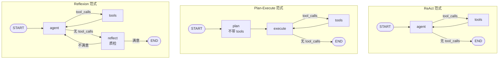
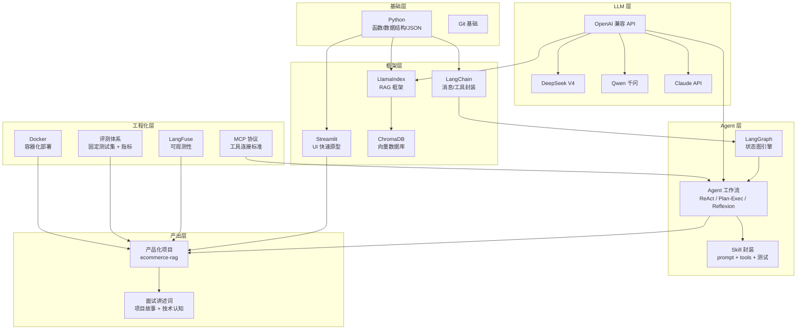
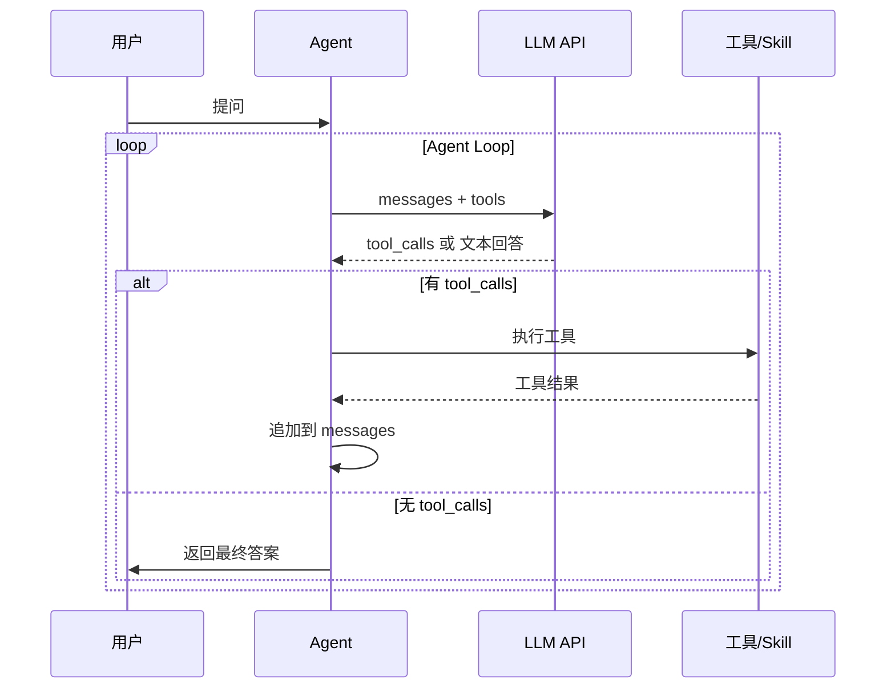

---
tags:
  - knowledge
  - ai-learning
  - python
  - llm
  - rag
  - streamlit
created: 2026-05-21
updated: 2026-06-09
---

# 知识点存档

> 每天学到的概念、语法、踩坑记录。配合 [[progress]] 使用。

---

## [[Python 基础]]

### 基础符号速查

| 符号 | 作用 | 易错点 |
|------|------|--------|
| `=` | 赋值，把右边放进左边 | 和 `==` 混淆——`=` 不是"相等" |
| `==` | 比较，相等返回 `True` | `if n%2 = 0` 报错，该用 `==` |
| `:` | 开启代码块（if/for/def 后），字典键值对 `{"k": v}`，切片 `[1:3]` | if 后面漏写 → `SyntaxError` |
| `()` | 函数调用 `len(x)`，元组 `(1,2)`，运算优先级 `(1+2)*3` | 调函数用 `()` 不是 `{}` |
| `[]` | 列表 `[1,2]`，索引取值 `lst[0]`，列表推导式 `[x for x in lst]` | 推导式外面要套 `[]` |
| `{}` | 字典 `{"k": v}`，集合 `{1,2}`，f-string 插值 `f"{x}"` | `return` 不是函数，返回字典用 `return {}` |
| `,` | 分隔参数/元素，单元素元组必须用它 | `(1)` 是数字，`(1,)` 才是元组 |
| `.` | 对象调属性/方法：`"hi".upper()` | 方法是 `text.isupper()` 不是 `isupper{text}` |
| `"` / `'` | 字符串，嵌套时交替避免冲突 | f-string 内 `\"` 转义 |
| `#` | 注释，后面内容不执行 | |
| `f` 前缀 | f-string：`f"{变量}"` 把变量值嵌入字符串 | 忘了 `f` → `{name}` 原样输出 |

### 函数

| 概念 | 要点 | 来源 |
|------|------|------|
| `def` 定义函数 | `def` 是注册名字，不是执行；定义在前，调用在后 | W1D1 |
| 参数 vs 实参 | 括号里声明的叫形参（parameter），调用时传的叫实参（argument） | W1D1 |
| 参数类型标注 | `def func(name: str) -> str:` 标注入参和返回值类型 | W1D1 |
| 返回值 | `return` 把数据传回给调用者；`print()` 只输出到屏幕，返回 `None` | W1D1 |
| 无参函数 | `def f():` 不需要输入，括号留空 | W4D5 |
| 有参函数 | `def f(word: str):` 需要输入，函数体内用到的变量必须在括号里声明 | W4D5 |
| `**dict` 字典展开 | `func(**{"key": val})` 等价于 `func(key=val)`，动态传参用 | W4D5 |
| 函数签名规则 | 函数体内出现的每个变量，要么来自参数，要么在函数内部创建 | W4D5 |
| 嵌套函数 | 在函数内部定义函数，内部函数只在外部函数内可见。`def outer(): def inner(): ...` | F1练习 |
| 返回值 | `return` 后面接的是"算完的结果"——可以是值、变量、表达式、函数调用结果、容器、f-string | F1练习 |

### JSON

| 概念 | 要点 | 来源 |
|------|------|------|
| JSON 本质 | 跨语言传数据的通用格式，本质是"长得像 Python 字典的字符串" | W4D5 |
| `json.loads()` | JSON 字符串 → Python 字典 | W4D5 |
| `json.dumps()` | Python 字典 → JSON 字符串 | W4D5 |
| 为什么需要 JSON | Python 和 API 服务器用不同语言，JSON 是中间格式 | W4D5 |

### 异常处理

| 概念 | 要点 | 来源 |
|------|------|------|
| `try/except` | `try` 包裹可能出错的代码，`except` 捕获异常并处理 | W1D1 |
| 兜底策略 | API 调用失败时返回错误信息，不让程序崩溃 | W1D1 |

### 文件读写

| 概念 | 要点 | 来源 |
|------|------|------|
| `with open()` | 上下文管理器，自动关闭文件，不用手动 `f.close()` | W1D2 |
| 文件模式 | `"r"` 读、`"w"` 写（覆盖）、`"a"` 追加 | W1D2 |
| `encoding="utf-8"` | 处理中文文件必须指定，否则乱码 | W1D2 |
| `.readlines()` | 返回列表，每个元素是一行（含末尾 `\n`） | W1D2 |
| `.write()` | 写入字符串到文件，不会自动加换行 | W1D2 |

### 字符串

| 概念 | 要点 | 来源 |
|------|------|------|
| `.strip()` | 去掉首尾空白字符（空格、换行、制表符） | W1D1 |
| `.rstrip()` | 只去掉右侧空白；`.rstrip("\n")` 精确去掉换行符 | W1D2 |
| `.startswith()` | 检查字符串是否以指定内容开头，比 `in` 更精确 | W1D2 |
| `f-string` | `f"{变量} 文字"` 格式化字符串 | W1D1 |
| f-string 进阶 | `{ }` 里可放表达式（运算、函数调用、字典取值），支持格式化（`.2f` 保留小数、`,.1f` 千分位）、对齐填充（`<` 左对齐、`>` 右对齐、`^` 居中） | F1练习 |

### 循环与条件

| 概念 | 要点 | 来源 |
|------|------|------|
| `for ... in` | 遍历列表每个元素 | W1D1 |
| `enumerate(seq, start)` | 同时拿到索引和值，`start` 设置起始序号 | W1D1 |
| `reversed(seq)` | 倒序遍历列表，返回迭代器，不额外占内存 | W2D1 |
| `list[::-1]` | 列表切片倒序，返回新拷贝的列表，会多占一份内存 | W2D1 |
| `continue` | 跳过本轮循环，进入下一轮 | W1D2 |
| `if/elif/else` | 多条件分支判断 | W1D1 |
| `for ... range(n)` | 固定次数循环，自动兜底防死循环，适合批处理 | W4D5 |
| `while` 循环 | 条件循环，`while True` 靠内部 `return`/`break` 退出，适合不确定次数的情况 | W4D5 |

### 数据结构

| 概念 | 要点 | 来源 |
|------|------|------|
| 列表 `[]` | 有序集合，`list[i]` 按下标访问，可增删改 | W1D1 |
| 字典 `{}` | 键值对集合，`dict["key"]` 访问 | W1D2 |
| 元组 `()` | 不可变列表——创建后不能增删改。单元素必须加逗号 `(1,)` 否则被当数字。能做字典键（列表不行） | F1练习 |
| `()` vs `[]` vs `{}` | `()` 函数调用+元组，`[]` 列表+索引取值，`{}` 字典+集合+f-string插值。碰函数用 `()`，构造容器认准各自括号 | F1练习 |
| 列表推导式 | `[对元素做什么 for 元素 in 原列表]` 一行生成新列表。本质是 for 循环的简写版 | F1练习 |

### 模块与入口

| 概念 | 要点 | 来源 |
|------|------|------|
| `import` | 导入外部模块或库 | W1D1 |
| `sys.argv` | 命令行参数列表，`sys.argv[1]` 是第一个参数 | W1D2 |
| `if __name__ == "__main__"` | 判断是否直接运行此文件（vs 被 import） | W1D2 |

---

## [[API 调用]]

| 概念 | 要点 | 来源 |
|------|------|------|
| OpenAI 客户端 | `OpenAI(api_key=..., base_url=...)` 可对接兼容接口 | W1D1 |
| `chat.completions.create()` | 发送对话请求，model + messages 是必填项 | W1D1 |
| system prompt | 设定 AI 的角色和行为 | W1D1 |
| `.env` 管理密钥 | `load_dotenv()` + `os.getenv()` 读取 API Key，不写死在代码里 | W1D1 |

### 多端点多客户端

| 概念 | 要点 | 来源 |
|------|------|------|
| 多客户端架构 | 不同模型走不同 API 端点，一个端点一个 `OpenAI()` 客户端实例 | W2D3 |
| provider 路由模式 | MODELS 字典每项加 `"provider"` 字段，`_clients[config["provider"]]` 查对应 client | W2D3 |
| 客户端缓存 | 用一个 `_clients = {}` 字典存所有 client，按 provider 名索引复用 | W2D3 |
| DashScope 兼容端点 | 千问走 `https://dashscope.aliyuncs.com/compatible-mode/v1`，模型名 `qwen-plus` | W2D3 |
| MiMo Token Plan 端点 | `tp-` 开头 Key 走 `https://token-plan-cn.xiaomimimo.com/v1`，无需本地代理 | W2D3 |

---

## [[模型选型与性能]]

> 基于 W2D3 4 模型实测数据（数学推理 / 代码 / 翻译三组对比）

| 模型 | 速度 | Token 效率 | 适用场景 |
|------|------|-----------|---------|
| DeepSeek Chat (V3) | ⭐⭐⭐ 最快 | ⭐⭐⭐ 最省 | 日常对话、翻译、代码、性价比首选 |
| DeepSeek Reasoner | ⭐⭐⭐ 快 | ⭐⭐ 中 | 数学推理、复杂逻辑，比 Chat 更简洁 |
| Qwen (千问) | ⭐ 慢 | ⭐ 费 | 输出丰富详细，适合需要多版本答案的场景 |
| MiMo-V2.5-Pro | ⭐⭐ 中 | ⭐⭐ 中 | Token Plan 免费期首选，输出结构清晰（表格/分节） |

**核心原则：** 简单任务不要用大炮打蚊子 — 翻译/代码用 Chat 模型又快又省，推理/数学才上 Reasoner。

### DS vs Qwen 行为差异（W2D4 深度对比）

> 基于 6 条系统化 prompt（翻译/推理/代码/指令遵循），详见 `projects/w2-model-battle/model-comparison.md`

| 维度 | DS Chat | Qwen | 面试金句 |
|------|---------|------|---------|
| 输出控制 | 问多少答多少 | 永远多给 3-5 倍内容 | "DS Chat 够用就好，Qwen 知无不言" |
| 中文表达 | 偏书面体 | 更自然口语化 | "Qwen 中文更像真人说话" |
| 推理风格 | 清单式，简洁 | 学术论文式，列公式 | "Qwen 把开放题当论文写" |
| Token 效率 | 6 题 1384 tok | 6 题 4628 tok（3.3x） | "正确率相同，成本差 3 倍" |
| 延迟 | 6 题 12.6s | 6 题 84.5s（6.7x） | "DS Chat 快一个数量级" |
| 正确率 | 6/6 | 6/6 | "结果都对，但过程完全不同" |

**选型结论：** 中文对话/创作首选 Qwen（母语级），逻辑推理和成本敏感场景选 DS Flash，代码场景两者无差异。

### DeepSeek 模型名陷阱（W2D4 发现）

| 发现 | 要点 | 来源 |
|------|------|------|
| `[[DeepSeek]]` 模型名陷阱 | `deepseek-chat` 已自动映射到 V4，2026.04.24 起生效 | W2D4 |
| V4 两个版本 | V4-Flash（轻量快）vs V4-Pro（旗舰强推理），Flash 性价比高，Pro 不总是更好 | W2D4 |
| 定期看 Changelog | 不看更新日志连自己调的什么模型都不知道——面试高频问题"你怎么跟踪模型变化" | W2D4 |

### V4-Flash vs V4-Pro vs Qwen 补充对比（W2D4 第二轮）

| 发现 | 要点 |
|------|------|
| Pro 在翻译上退步 | V4-Pro 用"backup nodes"而非"standby nodes"，耗时 5x 但术语反而不如 Flash |
| Pro 中文创作有进步 | "西湖像在轻轻地呼气"比 Flash 的"温吞吞的橘色"更有文学感 |
| Qwen 中文护城河 | 即使 V4-Pro 也追不上 Qwen 的母语级语感，"所以啊"、语气词、新意象碾压 |

---

## [[Streamlit]]

### 基础组件

| 概念 | 要点 | 来源 |
|------|------|------|
| `st.title()` | 页面标题，渲染为 `<h1>` | W1D3 |
| `st.text_area()` | 多行文本输入框，`height` 控制高度，`key` 标识状态 | W1D3 |
| `st.button()` | 按钮，点击返回 `True`，`type="primary"` 高亮 | W1D3 |
| `st.write()` | 万能输出，字符串、变量、Markdown 都能渲染 | W1D3 |
| `st.subheader()` | 小标题 | W1D3 |
| `st.divider()` | 分割线 `---` | W1D3 |
| `st.metric()` | 指标卡片，带 +/- 变化箭头 | W1D3 |

### 提示框

| 概念 | 要点 | 来源 |
|------|------|------|
| `st.warning()` | 黄色警告 | W1D3 |
| `st.error()` | 红色错误 | W1D3 |
| `st.success()` | 绿色成功 | W1D3 |
| `st.info()` | 蓝色提示 | W1D3 |
| `st.toast()` | 右下角轻提示，不遮挡主内容 | W1D3 |

### 布局

| 概念 | 要点 | 来源 |
|------|------|------|
| `st.columns(n)` | 等宽分列，返回 n 个对象，`with col:` 往里写内容 | W1D3 |
| `st.tabs(["A", "B"])` | 标签页，返回值解包到多个变量，`with tab:` 使用 | W1D3 |
| `st.sidebar.xxx()` | 所有 `st.xxx` 组件都可以前置 `sidebar.` 放到侧边栏 | W1D3 |
| `st.expander("标题")` | 折叠面板，`with expander:` 包裹可展开/收回的内容 | W1D3 |

### 输入组件

| 概念 | 要点 | 来源 |
|------|------|------|
| `st.selectbox()` | 下拉单选 | W1D3 |
| `st.radio()` | 单选按钮 | W1D3 |
| `st.multiselect()` | 多选下拉，返回列表，`default` 设置默认值 | W1D3 |
| `st.file_uploader()` | 文件上传，`type` 限制后缀，`.getvalue()` 拿字节 | W1D3 |

### 数据展示

| 概念 | 要点 | 来源 |
|------|------|------|
| `st.dataframe()` | 可交互表格（排序、列宽拖动、搜索） | W1D3 |
| `st.table()` | 静态表格，不能交互 | W1D3 |
| `pd.DataFrame(dict)` | pandas 字典转表格，`{"列名": [值列表]}` | W1D3 |

### 状态与反馈

| 概念 | 要点 | 来源 |
|------|------|------|
| `with st.spinner("文字")` | 加载动画，代码块执行完自动消失 | W1D3 |
| `st.progress(0~1)` | 进度条，`.progress(百分比, text="")` 更新 | W1D3 |
| `st.session_state` | 跨页面重刷保留数据的"保险箱"，`if "key" not in` 初始化 | W1D3 |
| `st.download_button()` | 下载按钮，`data` 给内容，`file_name` 给文件名 | W1D3 |

### Streamlit 核心机制

| 概念 | 要点 | 来源 |
|------|------|------|
| 脚本重跑 | 每次用户交互，整个脚本从头到尾重新执行一次 | W1D3 |
| 组件 key | 相同组件需要唯一 `key` 参数区分，否则报 `DuplicateElementId` | W1D3 |
| 变量不持久 | 普通变量每次重跑重置，要持久化用 `st.session_state` | W1D3 |
| `st.rerun()` | **停止当前脚本，从头重新执行。** 之后的代码不会运行。必须放在条件分支里，裸奔在外面会无限循环。先改数据再 rerun，下次进来值相等跳过 if | W2D1, W3D7 |
| `st.rerun()` 防无限循环 | 开关模式：`if 值变了 → 改值 → 重建 → rerun（重启）→ 值相等 → 跳过 if → 正常渲染` | W3D7 |
| session_state vs chat_mode | session_state 是**保活容器**（让对象跨重跑存活），chat_mode="context" 是**记忆机制**（把历史塞进 system prompt）。两者解决不同问题 | W3D7 |
| session_state 分离 | 展示用完整数据（last_battle），历史存截断版（battle_history），各司其职省内存 | W2D1 |

### 新增组件

| 概念 | 要点 | 来源 |
|------|------|------|
| `st.checkbox()` | 勾选框，返回 `True/False`，`value=True` 设置默认勾选，`help=` 鼠标悬停提示 | W2D1 |

### Chat 组件（W3D7）

| 概念 | 要点 | 来源 |
|------|------|------|
| `st.chat_input()` | 对话式输入框，自动带输入提示，用户回车后返回字符串 | W3D7 |
| `st.chat_message(role)` | 聊天气泡容器，`role="user"` 或 `"assistant"`，`with` 块内写内容 | W3D7 |
| `st.write_stream(generator)` | 接收 generator，逐个 yield 渲染，返回完整字符串——替代手动 `for chunk in gen` 拼接 | W3D7 |

---
## [[Python 进阶]]

### 时间与性能

| 概念 | 要点 | 来源 |
|------|------|------|
| `time.time()` | 返回当前 Unix 时间戳（秒浮点数），调用前后各取一次相减 = 耗时 | W2D1 |
| API 性能关注 | response.usage 可拿到 `prompt_tokens`、`completion_tokens`、`total_tokens` | W2D1 |

### 字典技巧

| 概念 | 要点 | 来源 |
|------|------|------|
| `.get(key, default)` | 安全从字典取值，key 不存在返回 default 而不是报 KeyError | W2D1 |
| `getattr(obj, attr, default)` | 安全从对象取属性，属性不存在返回 default 而不是报 AttributeError | W2D1 |
| 字典做配置 | `MODELS = {"key": {...}}` 管理模式，新增模型只加配置不改逻辑代码 | W2D1 |
| 字典推导式 | `{k: 处理(v) for k, v in dict.items()}` 一行完成过滤/转换 | W2D1 |

---

### dataclass 数据类（W5D5）

| 概念 | 要点 |
|------|------|
| `@dataclass` 装饰器 | 自动生成 `__init__`、`__repr__`、`__eq__`，省掉手写样板代码 |
| `field(default_factory=list)` | 可变默认值（list/dict）必须用 `default_factory`，不能直接写 `= []`——否则所有实例共享同一个列表 |

### Callable 类型标注（W5D5）

| 概念 | 要点 |
|------|------|
| `Callable` | 标注"这个变量存的是函数"，和 `str`/`int`/`list` 同类 |
| `tool_map: dict[str, Callable]` | 字典的值是函数引用，不是普通数据 |

### lambda 匿名函数（W5D5）

| 概念 | 要点 |
|------|------|
| `lambda 参数: 表达式` | 不需要 `def` 的函数，一行写完 |
| 常用场景 | 回调函数（`check=lambda ans: ...`）、排序 key（`key=lambda s: s["score"]`） |
| 限制 | 不能多条语句、不能有类型标注 |

### 闭包默认参数模式（W5D7）

| 概念 | 要点 |
|------|------|
| 问题 | for 循环里创建函数，所有函数引用同一个循环变量（循环结束后的最终值） |
| 解决 | 用默认参数 `_name=tool_name`——默认参数在**函数定义时**求值，能"定住"当前值 |

### create_model() 动态创建类（W5D7）

| 概念 | 要点 |
|------|------|
| `pydantic.create_model(name, **fields)` | 运行时动态生成 Pydantic model，不需要写 `class Xxx(BaseModel): ...` |
| 为什么需要 | MCP 工具的参数 schema 是运行时从 Server 拿到的，不能预先定义类 |

### sys.stderr vs sys.stdout（W5D6）

| 概念 | 要点 |
|------|------|
| `sys.stdout` | 标准输出，程序正常数据的出口 |
| `sys.stderr` | 标准错误，日志和错误信息的出口 |
| MCP 场景 | Server 用 stdout 传 JSON-RPC 协议数据，日志必须打到 stderr 避免污染 |

---

## [[asyncio 异步编程]]（W5D6-D7）

> Python 异步模型：`async def` + `await` + event loop。

### 核心概念

| 概念 | 要点 | 来源 |
|------|------|------|
| 同步 vs 异步 | 同步 = 一件事做完再做下一件；异步 = 等 IO 时可以切换到其他任务 | W5D6 |
| `async def` | 声明异步函数，函数体内可以用 `await` | W5D6 |
| `await` | "等这个异步操作完成，其间让出控制权给其他任务" | W5D6 |
| `asyncio.run()` | 同步世界调 async 的入口：创建事件循环 → 跑协程 → 关闭循环 | W5D6 |
| 事件循环 (event loop) | 异步程序的调度器，管理所有 async 任务的执行和切换 | W5D7 |

### async with — 异步上下文管理器（W5D6）

| 概念 | 要点 |
|------|------|
| `async with` | 和 `with` 一样是"自动关资源"，但用于异步资源（网络连接、子进程通信等） |

### async for — 异步迭代（W5D7）

| 概念 | 要点 |
|------|------|
| `async for` | 和 `for` 一样遍历，但每次迭代需要 await（如流式接收数据） |

### 踩坑

| 问题 | 原因 | 解决 |
|------|------|------|
| `asyncio.run()` 嵌套报 RuntimeError | Python 3.10+ 不允许在已运行的 event loop 里再调 `asyncio.run()` | 全程 async（工具用 `coroutine=`，图用 `astream()`）；或用 `nest_asyncio.apply()` |

---

## [[RAG]]（检索增强生成）

### 核心概念

| 概念 | 要点 | 来源 |
|------|------|------|
| `[[RAG]]` | Retrieval Augmented Generation，先检索再回答，给 LLM 限定信息来源避免幻觉 | W3D1 |
| 为什么需要 RAG | LLM 训练数据有截止日期，不知道你的业务知识，容易编造答案（幻觉） | W3D1 |
| RAG vs 直接 LLM | RAG = 开卷考试（有知识库），直接 LLM = 闭卷考试（靠训练数据猜） | W3D1 |

### [[LlamaIndex]] 四大核心

| 概念 | 要点 | 来源 |
|------|------|------|
| `[[Document]]` | 把原始文本包装成 LlamaIndex 能理解的对象 | W3D1 |
| `[[Node]]` | 把 Document 切成小块的文本片段，每块是一个检索单元 | W3D1 |
| `[[Index]]` | 把 Node 向量化后存到索引里，方便语义检索 | W3D1 |
| `[[QueryEngine]]` | 接收问题 → 检索相关 Node → 把原文+问题发给 LLM → 返回答案 | W3D1 |

### [[embedding|嵌入模型]]（Embedding）

| 概念 | 要点 | 来源 |
|------|------|------|
| `[[embedding|嵌入模型]]` 的作用 | 把文字转成向量，用于计算"哪段文本和问题最相关" | W3D1 |
| BAAI/bge-small-zh-v1.5 | 中文优化的轻量嵌入模型，本地运行不调 API | W3D1 |
| ModelScope 下载 | `snapshot_download("模型名")` 从阿里云国内直连下载，替代 HuggingFace | W3D1 |
| HF 镜像 | `os.environ["HF_ENDPOINT"] = "https://hf-mirror.com"` 但不如 ModelScope 稳定 | W3D1 |

#### 嵌入模型 vs LLM（W3D7 核心认知）

> 两者是完全不同的模型，在 RAG 里各司其职：

| | 嵌入模型 (Embedding) | 大模型 (LLM) |
|---|---|---|
| 干什么 | 文字 → 向量（浮点数数组） | 文字 → 文字（生成回答） |
| 不能干什么 | 不会写句子、不会回答问题 | 不会算两段话有多相似 |
| 输入 | `"云感T恤 129 元"` | `"根据以下资料回答：{检索结果}，问题是：{用户问题}"` |
| 输出 | `[0.12, -0.34, 0.67, ...]` | `"您好，云感T恤售价 129 元"` |
| 项目里用的 | `BAAI/bge-small-zh-v1.5`（本地 CPU） | `deepseek-v4-flash`（DeepSeek 服务器） |
| 调用时机 | 建索引 + 每次查询向量化问题 | 检索完成后生成回答 |

#### 常用嵌入模型速查

| 模型 | 维度 | 语言 | 特点 |
|------|------|------|------|
| `BAAI/bge-small-zh-v1.5` | 512 | 中文 | 轻量本地跑，你正在用 |
| `BAAI/bge-large-zh-v1.5` | 1024 | 中文 | 同系列大号，更准但更慢 |
| `text-embedding-3-small` | 512 | 多语言 | OpenAI，API 调用按 Token 计费 |
| `moka-ai/m3e-base` | 768 | 中文 | 开源社区常用，ModelScope 可下 |

### [[LlamaIndex]] 配置

| 概念 | 要点 | 来源 |
|------|------|------|
| `Settings.embed_model` | 全局设置嵌入模型，建索引时自动使用 | W3D1 |
| `Settings.llm` | 全局设置 LLM，查询时自动使用 | W3D1 |
| `OpenAILike` | LlamaIndex 通用 OpenAI 兼容接口，不校验模型名白名单 | W3D1 |
| `api_base` vs `base_url` | OpenAILike 用 `api_base`，原版 OpenAI 用 `base_url` | W3D1 |
| DeepSeek V4 beta 端点 | V4 需要 `api_base="https://api.deepseek.com/beta"`，V3 不需要 | W3D1 |

### 分块策略（Chunking）

| 概念 | 要点 | 来源 |
|------|------|------|
| 为什么需要切分 | LLM 上下文窗口有限，小块检索更精准，且向量化是按块进行的 | W3D2 |
| `SentenceSplitter` | LlamaIndex 默认切分器，按句子边界切，不会把一句话砍成两半 | W3D2 |
| `chunk_size` | 每块最大字符数，越小→Node 越多→检索更精准但上下文更少 | W3D2 |
| `chunk_overlap` | 相邻两块重叠的字符数，防止关键信息刚好落在两块的边界上被切断 | W3D2 |
| 实际测试 | 533 字符文档：chunk_size=256→3 块，512→2 块，1024→1 块（不够切） | W3D2 |

### 检索过程

| 概念 | 要点 | 来源 |
|------|------|------|
| `similarity_top_k` | 控制检索返回几个最相关的 Node，值越大信息越全但噪音越多 | W3D2 |
| `source_nodes` | response 的属性，包含了本次检索到的 Node 列表 | W3D2 |
| `source.score` | 相似度分数（0~1），越高越相关，但高分不一定等于精确匹配 | W3D2 |
| 检索流程 | 用户问题→向量化→和索引中每个 Node 的向量比余弦相似度→取 top_k | W3D2 |

### 索引持久化

| 概念 | 要点 | 来源 |
|------|------|------|
| 索引持久化 | `StorageContext` 管理存/读，`persist()` 序列化到硬盘，`load_index_from_storage()` 恢复，实测快 19x | W3D2 |
| `index.storage_context.persist()` | 把建好的索引序列化存到硬盘，只需执行一次 | W3D2 |
| `load_index_from_storage()` | 从硬盘恢复索引，不需要重新 embedding，实测快 19x | W3D2 |
| build once, load many | 建一次索引（build_index.py），以后每次启动直接加载（query_index.py） | W3D2 |

### Prompt 模板

| 概念 | 要点 | 来源 |
|------|------|------|
| prompt 在 RAG 里的角色 | 不是手写完整 messages，而是设计"填空题"——`{context_str}` 和 `{query_str}` 是占位符 | W3D2 |
| `{context_str}` | 占位符，LlamaIndex 在查询时自动替换为检索到的文档片段 | W3D2 |
| `{query_str}` | 占位符，自动替换为用户的问题 | W3D2 |
| `PromptTemplate` | LlamaIndex 的自定义模板类，传一个字符串即可定制 prompt 格式 | W3D2 |
| `get_prompts()` | 查看当前 query engine 使用的默认模板，调试用 | W3D2 |
| 自定义模板的意义 | 控制 LLM 行为边界——"资料没有就说不知道"防止幻觉，"不超过 3 句话"控制输出长度 | W3D2 |

### chat_engine 对话式 RAG（W3D3）

| 概念 | 要点 | 来源 |
|------|------|------|
| `query_engine` | 无状态，每次 `.query()` 独立，不知道已发生过什么对话 | W3D3 |
| `chat_engine` | 有状态，内部维护 `chat_history`，自动记住上文 | W3D3 |
| `chat.chat("消息")` | 发送消息并得到回复，历史自动累积 | W3D3 |
| `chat.chat_history` | 内部记忆列表，`[{user}, {assistant}, {user}, {assistant}, ...]`，每轮 +2 条 | W3D3 |

### 三种 chat_mode（W3D3-W3D4）

| mode | 原理 | 实测结论 |
|------|------|---------|
| `default` | 历史+检索放 messages 列表 | ❌ 新版 LlamaIndex 已废弃 |
| `condense_question` | 先让 LLM 把追问+历史重写成独立问题，再检索 | ⚠️ 结果不稳定，重写后检索可能跑偏 |
| `context` | 聊天历史全文塞进 system prompt | ✅ 中文多轮最稳定，指代消解能力最强 |

### chat_engine 进阶（W3D4）

| 概念 | 要点 | 来源 |
|------|------|------|
| `chat.reset()` | 清空全部聊天历史，适合话题彻底切换 | W3D4 |
| `stream_chat()` | 流式输出，逐 token 实时返回，提升用户体验 | W3D4 |
| `response.response_gen` | 流式输出的生成器，`for chunk in ...: print(chunk, end="")` | W3D4 |
| `response.source_nodes` | 查看 LLM 回答的检索依据（原文片段 + 相似度分数） | W3D4 |
| `source.score` | 相似度 0~1，但高分≠精确——实验发现检索到退货政策但 LLM 仍能答对会员权益 | W3D4 |
| `AgentChatResponse` | chat_engine 返回的类型（不是普通字符串），含多个属性 | W3D4 |
| 检索≠回答依据 | LLM 可能在检索不相关时用自己的知识回答——知识库更新时是风险 | W3D4 |

### 多文档索引（W3D5）

| 概念 | 要点 | 来源 |
|------|------|------|
| `Document(text, metadata)` | metadata 是 dict，可存 category/source/date 等任意标签，Node 切分时继承 | W3D5 |
| 跨文档检索 | 所有 Document 的 Node 进同一个向量库，检索自动跨越文档边界，不需切换代码 | W3D5 |
| `MetadataFilter(key, operator, value)` | 单条过滤规则：字段名 + 运算符 + 目标值 | W3D5 |
| `MetadataFilters(filters, condition)` | 组合多条 MetadataFilter，condition 为 `"and"` / `"or"`（注意小写） | W3D5 |
| `FilterOperator.EQ` | 等值比较，还有 NE/GT/LT/GTE/LTE/IN | W3D5 |
| `index.as_query_engine(filters=...)` | 检索时加过滤筛子，同一份索引可用不同 filter 反复查，不需重建 | W3D5 |
| `condition="and"` vs `"AND"` | 必须小写，大写会触发 Pydantic 校验错误 | W3D5 |

### 建索引 vs 查询的导入差异（W3D6）

| 导入 | 建索引 | 查询 | 原因 |
|------|:--:|:--:|------|
| `Document` | ✅ | ❌ | 建索引需包装文本，查询时已在索引里 |
| `VectorStoreIndex` | ✅ | ❌ | 查询用 `load_index_from_storage` 替代 |
| `SentenceSplitter` | ✅ | ❌ | 切分一次性，查询时 Node 已切好 |
| `MetadataFilters/MetadataFilter/FilterOperator` | ❌ | ✅ | 过滤是查询时加的筛子 |
| `load_index_from_storage` | ❌ | ✅ | 建索引写磁盘，查询读磁盘 |

共同依赖：`Settings`、`StorageContext`、嵌入模型、LLM — 不管建还是查都要配。

### 初级 RAG vs 生产级 RAG

| 维度 | 你现在 | 生产级 |
|------|--------|--------|
| 文档量 | 4 份 | 数千～百万份 |
| 存储 | 本地文件 | 向量数据库（Chroma/Milvus/Pinecone） |
| 检索策略 | 纯向量相似度 | 混合检索（向量 + BM25 关键词） |
| 结果优化 | 无 | 重排序（ReRanker） |
| 分块 | 固定 512 | 按文档结构智能切分 |

### 动态过滤切换（W3D7）

| 概念 | 要点 | 来源 |
|------|------|------|
| 重建 chat_engine | 切换品类时不能只改 filter 参数，必须重建整个 chat_engine（因为 filter 是创建时固化的） | W3D7 |
| 切换检测模式 | session_state 存 `current_category`，每次渲染对比 radio 值 → 变了就删旧 engine → 重建 → `st.rerun()` | W3D7 |
| chat_engine 生命周期 | 存在 `st.session_state["chat"]` 里跨重跑存活；品类切换或重置时删除/重建 | W3D7 |
| 先改值再 rerun | `current_category = 新值 → 重建 engine → st.rerun()`。如果先 rerun 再改值，下次进来值没变又会触发 | W3D7 |

### RAG 数据结构类型（W3D7）

| 类型 | 来源 | 访问方式 | 易错点 |
|------|------|---------|--------|
| `ChatMessage` | `chat.chat_history[i]` | `msg.role.value` / `msg.content` | 不是 dict，不能用 `msg["role"]` |
| `NodeWithScore` | `response.source_nodes[i]` | `node.score` / `node.node.metadata` / `node.node.text` | metadata 在 `.node` 里，不是顶层 |
| `ChatMessage.role` | 枚举 `MessageRole.USER` / `MessageRole.ASSISTANT` | `.value` 拿到 `"user"` / `"assistant"` 字符串 | 不调 `.value` 拿的是枚举对象不是字符串 |

### 对话双重存储（W3D7）

| 存储位置 | 格式 | 谁在用 | 怎么维护 | 删了会怎样 |
|----------|------|--------|---------|-----------|
| `st.session_state["messages"]` | `[{"role": "user", "content": "..."}]` | 你（渲染页面） | 手动 append | 页面上看不到历史，LLM 记忆不受影响 |
| `chat.chat_history` | `[ChatMessage, ChatMessage, ...]` | LlamaIndex（context mode） | chat_engine 自动维护 | AI 失去上下文记忆，变回无状态问答 |
| 为什么两个都要 | messages 让你自由控制页面显示，chat_history 让 LlamaIndex 把历史塞进 prompt。各管各的 | W3D7 |

### RAG 全链路（W3D7 总结）

```
文档 → Document → Node → Embedding模型 → 向量 → 索引存储
                                                    ↓
用户问题 → Embedding模型 → 问题向量 → 余弦相似度匹配 → top_k Node
                                                    ↓
                            LLM ← prompt(检索结果 + 问题 + 聊天历史)
                                                    ↓
                                                流式回答
```
| 来源 | W3D7 |

### 项目环境搭建

| 概念 | 要点 | 来源 |
|------|------|------|
| 虚拟环境 | `python -m venv .venv`，每个项目独立一套环境，互不干扰 | W3D1 |
| 环境三要素 | `.venv/`（包）+ `.env`（密钥）+ 代码文件 | W3D1 |

---

## [[Prompt Engineering 进阶]]（W4D3）

### 结构化 Prompt 五段法

| 段落 | 作用 | 回答的问题 |
|------|------|-----------|
| **System** | 角色定义 | 你是谁？ |
| **Context** | 背景信息 | 目标用户/平台/竞品是什么？ |
| **Instruction** | 具体指令 + 输出格式 | 做什么？步骤？输出什么结构？ |
| **Examples** | 正例 + 反例 | 什么样算好？什么样算差？ |
| **Constraints** | 约束条件 | 不能做什么？长度/风格限制？ |

### 实测对比（中文商品描述 → 英文亚马逊 listing）

| 版本 | Token | 耗时 | 标题质量 | 卖点呈现 | 输出格式 |
|------|-------|------|---------|---------|---------|
| A. 裸奔 | 1197 | 12.1s | 中式直译 | 黏在一起 | 自由发挥 |
| B. 一句话 | 537 | 4.8s | 略有优化 | 有分段 | 自由发挥 |
| C. 五段法 | 1460 | 10.3s | SEO 友好 | 逐一拆开 | 严格按模板 |

**结论：** 五段法 Token 最多但买到了可控性——固定输出格式、卖点分离清晰、英文更地道。工程化场景里这点成本换稳定性完全值得。

### 核心认知

- **可控性 > Token 成本：** 多花几百 Token 换来固定结构，后续解析/展示不用再猜格式
- **Constraint 比 Instruction 更有效：** "不要直译"四个字挡掉了前两个版本的主要问题
- **工作流化：** prompt 模板固化后，同品类（裤子/鞋子/配件）只需换 Context，不复用重写

| 来源 | W4D3 |

### Prompt 工程化实战（W4D4）

> 将 battle.py 从"无 system prompt"升级为可切换、可编辑的模板系统。

**改造内容：**
- `PROMPT_TEMPLATES` 字典管理 4 个场景（无模板/翻译/代码/推理），每个用五段法
- sidebar 加 `selectbox` 选场景 + `expander` 内 `text_area` 可编辑 prompt
- `day4_test_cases.py`：3 条固定测试，每次改 prompt 后跑一遍验证

**踩坑：**
- **prompt 一致性：** 改一段（Context）没改另一段（Examples），模型跟着旧信息跑偏。全部关联段落要同步改
- **user message 权重 ≥ system prompt：** 两边冲突时模型倾向信 user message。改了 prompt 模板还要检查输入里有没有矛盾信息
- **测试关键词要对齐语言：** `check_contains` 用中文关键词但模型输出英文 → 误报 FAIL。关键词要和 prompt 约束的输出语言一致

### 独立练习：邮件润色场景（W4D4）

> 不看代码模板，从零写一个邮件润色的五段法 prompt。

**学到的：**
- **Context 不要列能力：** 第一次写了四条"你能够..."在凑数。Context 是给背景信息（发件人身份、收件人、行业），不是复读 System
- **输出格式要提前定：** 没指定格式时模型跑出流水文。加了 `【润色后邮件】` + `【修改建议】` 后输出可解析、用户知道改了哪里
- **约束要贴近业务：** 邮件场景最关键的约束是"不改变原意（时间/地点/金额/需求）"，不是泛泛的"回答清晰"

**模板 vs 无模板实测对比（中文商务邮件 → 英文）：**

| | 无模板 | 邮件模板 |
|------|--------|---------|
| 邮件正文 | 英文，格式基本正确 | 英文，结构更完整（含 Subject） |
| 修改说明 | 无 | 逐条指出改了什么、为什么改 |
| 公司名纠错 | 自动改了 SUMSUNG→Samsung | 改了并说明原因 |
| 缺失信息 | 不提示 | 提示"网址缺失，建议补充" |
| 整体价值 | 翻译完就没了 | 翻译 + 教学，知道怎么改进 |

**结论：** 无模板也能翻对，但邮件模板多了"告诉用户为什么改"——这才是业务场景里的增值部分。

| 来源 | W4D4 |

---

## [[ChromaDB]] 向量数据库（W4D1）

### 核心概念

| 概念 | 要点 | 来源 |
|------|------|------|
| 向量数据库 | 存语义（向量）而非存文字——通过比较向量距离来判断"是不是在说同一件事" | W4D1 |
| ChromaDB | 轻量开源向量数据库，Python 原生，适合小中型项目（1000~百万级文档） | W4D1 |
| Collection | ChromaDB 的组织单元，类似 SQL 表——存 documents + embeddings + metadatas + ids | W4D1 |
| `chromadb.PersistentClient()` | 持久化模式，数据存硬盘，重启还在。比 LlamaIndex 手动 persist 更自动 | W4D1 |
| `collection.add()` | 添加文档，ChromaDB 自动调嵌入模型向量化后存库 | W4D1 |
| `collection.query()` | 问题自动向量化→和库里所有向量比距离→返回 top_k。传 `query_texts` + `n_results` | W4D1 |
| distance（距离） | ChromaDB 默认返回余弦距离，**越小越相似**（0=完全相同）。和 LlamaIndex score（越大越相似）相反 | W4D1 |

### 嵌入函数

| 概念 | 要点 | 来源 |
|------|------|------|
| `embedding_function` | 创建 Collection 时指定，负责把文字转成向量。ChromaDB 自带英文模型，中文场景必须换 | W4D1 |
| `SentenceTransformerEmbeddingFunction` | ChromaDB 方式加载模型：`model_name=` 可接 HuggingFace 模型名或本地路径 | W4D1 |
| 本地模型路径 | 用 ModelScope 缓存的绝对路径（`~/.cache/modelscope/hub/models/...`），跳过网络下载 | W4D1 |

### 元数据过滤

| 概念 | 要点 | 来源 |
|------|------|------|
| `where={"key": "value"}` | 精确过滤，等于 LlamaIndex 的 `MetadataFilter`，但在数据库层面执行 | W4D1 |
| `where={"$and": [...]}` | 组合条件，也支持 `$or`、`$in`、`$gte` 等操作符 | W4D1 |
| 过滤 vs 检索顺序 | ChromaDB 先过滤再检索，比"先搜出来再筛"更高效 | W4D1 |

### 增删改

| 概念 | 要点 | 来源 |
|------|------|------|
| `collection.update(ids=[...])` | 按 ID 更新文档内容和元数据 | W4D1 |
| `collection.delete(ids=[...])` | 按 ID 删除文档 | W4D1 |
| `collection.upsert()` | 存在就更新，不存在就插入——一条命令覆盖两种场景 | W4D1 |

### ChromaDB + LlamaIndex 集成

| 概念 | 要点 | 来源 |
|------|------|------|
| `ChromaVectorStore(chroma_collection=collection)` | 把 ChromaDB Collection 包装成 LlamaIndex 认识的 VectorStore | W4D1 |
| `StorageContext.from_defaults(vector_store=...)` | 告诉 LlamaIndex"向量存在 ChromaDB 里"——存储层可插拔的关键 | W4D1 |
| `VectorStoreIndex.from_documents(docs, storage_context=...)` | 建索引时自动把向量写入 ChromaDB，和本地存储建索引写法完全一样 | W4D1 |
| `index.storage_context.persist()` | 只存索引元数据（Node 结构等），向量由 ChromaDB 自己管理 | W4D1 |
| `load_index_from_storage(storage_context=...)` | 恢复索引：向量从 ChromaDB 读 + 元数据从磁盘读，不需要重新 embedding | W4D1 |

### ChromaDB vs SimpleVectorStore 对比

| 维度 | SimpleVectorStore (W3) | ChromaDB (W4) |
|------|------------------------|---------------|
| 存储格式 | JSON + .bin 文件 | SQLite + Parquet（数据库引擎） |
| 加载方式 | 全量加载到内存 | 按需读取，有索引加速 |
| 适合文档量 | < 1000 | 1000 ~ 百万级 |
| 并发查询 | 不支持 | 支持多客户端同时查 |
| 增量写入 | 需要 full rebuild | 直接 add，实时可见 |
| 生产环境 | 不适合 | 适合小中型项目 |

- 面试金句：SimpleVectorStore 适合原型验证，文档量上千或需增量更新时切换到 ChromaDB。切换成本很低——LlamaIndex 的 VectorStore 抽象层让换存储引擎只需改几行代码。

### 踩坑

| 问题 | 原因 | 解决 | 日期 |
|------|------|------|------|
| `UnicodeEncodeError: 'gbk' codec` | Windows 终端默认 GBK 编码，无法打印 emoji | 避免在 print 中用 emoji（如 `✅`） | W4D1 |
| ChromaDB 默认嵌入模型下载极慢 | `all-MiniLM-L6-v2` 从 AWS S3 下载 80MB，国内很慢 | 用 `SentenceTransformerEmbeddingFunction` 指向 ModelScope 缓存的中文模型 | W4D1 |
| `OpenAI` (新) 校验模型名白名单 | LlamaIndex 0.14+ 的 `llama_index.llms.openai.OpenAI` 只认 OpenAI 官方模型名 | 用 `llama_index.llms.openai_like.OpenAILike`（需单独 `pip install llama-index-llms-openai-like`），不校验模型名 | W4D1 |
| `load_index_from_storage()` 报找不到索引 | 只传 vector_store 不够，还需 persist_dir 指定元数据位置 | 先 `index.storage_context.persist(persist_dir=...)`，再加载时传 `StorageContext.from_defaults(vector_store=..., persist_dir=...)` | W4D1 |

### SimpleVectorStore → ChromaDB 迁移实战（W4D2）

| 概念 | 要点 | 来源 |
|------|------|------|
| 迁移改什么 | 改三处：建索引时加 ChromaDB client/collection/ChromaVectorStore；加载时先连 ChromaDB 再 load_index_from_storage；其余代码（分块/嵌入/LLM/chat_engine/过滤）完全不变 | W4D2 |
| build once, load many | build_index.py 建库（一次性，`create_collection` + `VectorStoreIndex` + `persist`），app.py 每次启动只加载（`get_collection` + `load_index_from_storage` | W4D2 |
| 两次持久化 | ChromaDB 自动存向量（SQLite），LlamaIndex 的 `persist()` 只存元数据（docstore/index_store）——两者各管各的，加载时两个都要 | W4D2 |
| Collection 名称一致性 | build 的 `create_collection(name="xxx")` 和 app 的 `get_collection("xxx")` 必须同名 | W4D2 |
| metadata 值一致性 | build_index 写入的 metadata category 值和 app 过滤用的值必须完全一致，否则品类筛选无结果 | W4D2 |
| 品类切换 = 新会话 | 切换品类时重建 chat_engine 会清空 chat_history，上下文丢失。这是当前设计的 trade-off | W4D2 |

| 问题 | 原因 | 解决 | 日期 |
|------|------|------|------|
| `VectorStoreIndex()` 无赋值 | 创建了 index 但没赋给变量，下一行调 `index.xxx` 报 NameError | `index = VectorStoreIndex(...)` | W4D2 |
| 变量名 typo（cilent/client） | 拼写错误不报语法错，运行时才炸 NameError | 仔细检查变量名 | W4D2 |
| `MetadataFilter` vs `MetadataFilters` | 单数是过滤条，复数是装多条规则的容器 | 单条用 `MetadataFilter`，多条用 `MetadataFilters(filters=[...])` | W4D2 |
| W4 venv 缺 streamlit | Day 1 只用 ChromaDB 不需要 streamlit，Day 2 新增依赖 | `pip install streamlit` | W4D2 |

---

## [[Agent Loop]]（W4D5）

> 不用任何框架，纯 OpenAI API 的 `tools` 参数实现 Agent 循环。

### 核心概念

| 概念 | 要点 | 来源 |
|------|------|------|
| Agent Loop | LLM 反复调工具直到能回答用户的循环：调 API → 判断 → 执行工具/返回答案 | W4D5 |
| ReAct 模式 | Reasoning + Acting，LLM 先思考要不要用工具，再用工具，再看结果 | W4D5 |
| `tools=` 参数 | `chat.completions.create(tools=TOOLS)` 告诉 LLM 有哪些工具可用 | W4D5 |
| `msg.tool_calls` | LLM 返回工具调用请求时用这个字段判断，非 `None` 表示要调工具 | W4D5 |
| TOOLS 结构 | `{"type": "function", "function": {"name": "...", "parameters": {...}}}` | W4D5 |
| TOOL_MAP | 工具名字符串 → 实际 Python 函数的映射字典，循环里动态调用 | W4D5 |

### 循环流程

```
用户提问 → messages = [system, user]
  ↓
for turn in range(max_turns):
  ├─ 调 API（带 tools=TOOLS）
  ├─ 如果 msg.tool_calls：
  │    ├─ 取 tool_name + tool_args
  │    ├─ TOOL_MAP[tool_name](**tool_args) 执行
  │    ├─ messages 追加 assistant(tool_calls) + tool(result)
  │    └─ 继续循环
  └─ 如果没有 tool_calls：
       └─ 返回 msg.content（最终答案）
```

### 踩坑

| 问题 | 原因 | 解决 |
|------|------|------|
| 函数体用 `word` 但声明里没写参数 | 函数体内用到的变量必须在括号里声明 | `def f(word: str):` |
| `return print(...)` | `print()` 返回 `None`，只有输出没有传值 | 要传值用 `return`，要显示用 `print` |
| TOOLS 里函数名抄错 | 复制粘贴没改干净 | 复制完逐项检查关键字段 |
| `properties` 拼成 `properyies` | 手滑 | 跑一下就能发现 SyntaxError |
| `len(str)` 不是 `len(word)` | `str` 是内置类型名，不是你的变量 | 变量名是你起的，别和内置名冲突 |

---

## [[Agent Chat 交互界面]]（W4D6）

> 把命令行 Agent Loop 升级成 Streamlit 聊天界面，学习 yield 生成器 + 新 UI 组件。

### 新概念

| 概念 | 要点 | 来源 |
|------|------|------|
| `yield` 生成器 | 函数可以多次返回值，每次 yield 后暂停，下次从暂停处继续；return 只返回一次 | W4D6 |
| `st.chat_message()` | 聊天气泡组件，把消息内容圈在一个聊天气泡里显示 | W4D6 |
| `st.chat_input()` | 底部聊天输入框，回车发送，返回用户输入的字符串 | W4D6 |
| `st.status()` | 可展开的状态框，用 `with` 创建，`st.write` 往里写内容，`status.update` 改标题和状态 | W4D6 |
| `pass` 占位符 | Python 要求缩进块至少一行代码，`pass` 什么都不做，纯粹占位，以后替换成真正代码 | W4D6 |
| 多轮对话记忆 | `for m in st.session_state.messages: messages.append(m)` 把历史对话传给 LLM，让它知道"刚才聊了什么" | W4D6 |

### JSON Schema 工具定义结构

```
TOOLS = [
    {
        "type": "function",           # 固定写法
        "function": {
            "name": "工具名",          # LLM 通过名字识别工具
            "description": "用途说明",  # LLM 据此判断何时调用
            "parameters": {
                "type": "object",      # 固定 "object"
                "properties": {        # {} 对象，每项有参数名
                    "参数名": {
                        "type": "string",
                        "description": "参数说明"
                    }
                },
                "required": ["参数名"]  # [] 数组，列出必填参数
            }
        }
    }
]
```

| 符号 | 含义 | 例子 |
|------|------|------|
| `{}` | 对象/字典（键值对，每项有名字） | `properties: {}` — 参数定义 |
| `[]` | 数组/列表（按顺序排列） | `required: []` — 必填参数名列表 |

### TOOL_MAP 的作用

Agent 收到的是工具名**字符串**（如 `"calculate"`），不能直接 `"calculate"(args)` 调用。TOOL_MAP 是字符串→函数的桥梁：`TOOL_MAP["calculate"]` 拿到函数对象后才能执行 `func(**args)`。

---

## [[踩坑记录]]

| 问题                            | 原因                                                            | 解决                                                               | 日期   |
| ----------------------------- | ------------------------------------------------------------- | ---------------------------------------------------------------- | ---- |
| `IndentationError`            | Python 用缩进划分代码块，冒号 `:` 后必须缩进                                  | 检查缩进级别，统一用 4 空格                                                  | W1D1 |
| try/except 对齐                 | `try` 和 `except` 必须在同一缩进级别                                    | 确保对齐                                                             | W1D1 |
| `NameError: not defined`      | 函数还没定义就调用了                                                    | 定义写在调用之前                                                         | W1D2 |
| 函数调用自己                        | 函数体内调用同名函数导致死循环                                               | 调用代码写在 `def` 外面                                                  | W1D2 |
| `with` 后面无内容                  | `with ... :` 后下一行必须缩进且有代码                                     | 冒号后写逻辑，缩进 4 格                                                    | W1D2 |
| `readlines()` 带 `\n`          | 每行末尾自带换行符                                                     | 用 `.rstrip("\n")` 去掉                                             | W1D2 |
| `StreamlitDuplicateElementId` | 同页面多个相同组件没有唯一 key                                             | 给每个组件加唯一的 `key` 参数                                               | W1D3 |
| `columns` 内容跑出布局              | `with col2:` 内的代码缩进错误，变成在并排区域外面                               | 检查缩进确保在 `with col:` 块内                                           | W1D3 |
| f-string 嵌套双引号                | `f"等待{config["name"]}"` 中双引号套双引号导致 SyntaxError                | 内层用单引号：`f"等待{config['name']}"`                                   | W2D1 |
| 变量先于定义使用                      | `choice = response.choices[0]` 写在 `response = ...create()` 前面 | 先创建 response 再从中取值，顺序不能反                                         | W2D1 |
| 展示区缩进在按钮内                     | 结果展示写在 `if st.button()` 里面，`st.rerun()` 后永远不执行                | 展示区顶到左边和按钮 `if` 平级                                               | W2D1 |
| Chat 模型耗时异常                   | deepseek-chat 有时 36 秒，正常应该是 3-5 秒                             | 服务端排队/网络波动，不代表模型本身速度                                             | W2D1 |
| Reasoner 引入不必要的库              | V3 为矩阵运算引入了 numpy，斐波那契完全不需要                                   | 代码评审关注：是否引入了不必要的依赖                                               | W2D1 |
| `st.rerun()` 放在按钮外导致无限刷新      | sidebar 历史展示区里放了 st.rerun()，每次渲染都触发重跑                         | st.rerun() 必须放在按钮的 else 分支里，不在展示区                                | W2D1 |
| Python 函数同名参数覆盖               | `OpenAI(api_key=A, api_key=B)` 后一个 api_key 覆盖前一个，不报错          | 不同端点的 client 各自创建实例，用字典索引                                        | W2D3 |
| 变量赋值是替换不是追加                   | `client = A; client = B; client = C` 只剩 C 一个值                 | 用字典 `{"a": A, "b": B, "c": C}` 存多个实例                             | W2D3 |
| 千问模型名填错导致巨慢                   | `qwen3.6-plus` 不是标准名，导致 33 秒才返回                               | 用 `qwen-plus`（DashScope 标准模型名）                                   | W2D3 |
| Qwen 过度输出                     | 简单问题给出 2000+ Token 论文式回答，Token 是 DS Chat 的 3.3 倍              | 需要精确控制输出长度时加 system prompt 约束，如"用不超过 3 句话回答"                     | W2D4 |
| f.read() 末尾逗号变元组              | `knowledge = f.read(),` 末尾逗号让变量变成 `(内容,)` 元组而非字符串             | 去掉末尾逗号                                                           | W3D1 |
| encoding 写在 open() 外面         | `f.read(), encoding="utf-8"` 被 Python 解析为元组                   | `encoding` 是 `open()` 的参数：`open("f.txt", "r", encoding="utf-8")` | W3D1 |
| HF 下载卡住                       | HuggingFace 在国内被墙，model.safetensors 无进度                       | 用 ModelScope `snapshot_download()` 国内直连                          | W3D1 |
| OpenAI/OpenAILike 参数名不同       | `OpenAI` 用 `base_url`，`OpenAILike` 用 `api_base`               | 查 `inspect.signature(Class.__init__)` 确认参数名                      | W3D1 |
| DeepSeek V4 400 错误            | `deepseek-v4-flash` 走 beta 通道，标准接口返回 400                      | `api_base="https://api.deepseek.com/beta"`                       | W3D1 |
| `MetadataFilters` condition 大小写 | `condition="AND"` 触发 Pydantic ValidationError，报 enum 错误         | 必须用小写 `condition="and"`                                         | W3D6 |
| deepseek-v4-flash Empty Response | 检索正常但 LLM 返回空，Django 问题正常但 CSS 问题为空——非代码 bug，模型行为不稳定          | 单次只问一件事，或换 deepseek-chat                                        | W3D5 |
| query.py 缺少 Settings 配置       | 加载索引后直接用 as_query_engine 但没配 embed_model 和 llm，导致查询时无模型可用   | 在 load_index_from_storage 之前配好 Settings.embed_model + Settings.llm | W3D6 |
| `st.rerun()` 放 if 外导致无限刷新     | `st.session_state["messages"] = []` 和 `st.rerun()` 没缩进在 `if st.button()` 内，每次渲染都触发 | st.rerun() 必须在按钮的 if 分支里面 | W3D7 |
| `for msg,` 多余逗号               | `for msg, in list` 被 Python 解析为元组解包，ChatMessage 对象不可迭代 | 去掉末尾逗号：`for msg in list` | W3D7 |
| ChatMessage 当成 dict 用          | `msg["role"]` 访问 ChatMessage 对象，但它是对象不是字典 | 用 `msg.role.value` 和 `msg.content` 属性访问 | W3D7 |
| source_nodes 层级混淆             | `node.metadata` 直接取——`source_nodes` 返回的是 `NodeWithScore` 列表，metadata 在 `node.node.metadata` 里 | 用 `node.node.metadata` 取元数据 | W3D7 |
| `print` 当 `return` 用          | 函数用 `print()` 输出却期望拿到返回值，`print` 只显示在屏幕上，函数实际返回 `None` | 用 `return` 把值交出去 | F1练习 |
| 括号混用（`{}` 调函数）              | `len{text}`、`isupper{text}` 用花括号调函数 | 函数和方法一律用 `()`：`len(text)`、`isupper()` | F1练习 |
| 变量名混淆                        | `def calc(p): return prices*0.8` 内部用外层列表变量而非参数 | 函数体内用自己参数名 `p` 而非外层变量 `prices` | F1练习 |
| 中文标点 vs 英文标点                | `f"你好，{name}!"` 用英文 `!`，测试期望中文 `！` | 字符串内容注意中英文标点一致 | F1练习 |
| `chromadb` 与 `sentence-transformers` 版本不兼容 | `chromadb 1.5.9` + `sentence-transformers 5.5.1` → `RustBindingsAPI` 报错 | 降级 `sentence-transformers==3.0.1` | W4D7 |
| ChromaDB collection embedding 不一致 | 建库没用 BGE，查库指定 BGE → `ValueError: embedding function conflict` | 重建 collection 统一 embedding function | W4D7 |
| `langgraph.checkpoint.sqlite` 模块找不到 | LangGraph 1.x 把 checkpoint 实现拆成独立包，不随 `langgraph` 自动安装 | `pip install langgraph-checkpoint-sqlite` | W5D4 |
| `interrupt()` 不抛异常 | LangGraph 1.2.4 中 interrupt 不抛 `GraphInterrupt`，而是 `invoke()` 正常返回，结果里带 `__interrupt__` 字段 | 用 `if "__interrupt__" in result` 判断，不能用 try/except | W5D4 |
| 拒绝 tool_calls 后 `add_messages` append → LLM 报错 | DeepSeek 要求每条 tool_calls 消息后面必须有匹配的 tool messages。直接 append 拒绝消息不删原 tool_calls 消息 → 400 error | 用 `RemoveMessage(id=msg.id)` 删掉原 tool_calls 消息，再 append 替换消息 | W5D4 |

---

## [[Agent + ChromaDB 集成]]（W4D7）

> 将 ChromaDB 知识库作为 Agent 的工具，实现自主检索 + 回答。

### 核心架构

```
用户问题 → Agent Loop（LLM + tools）
                │
                ├─ search_knowledge_base(query)  ← 查 ChromaDB
                ├─ calculate(expression)          ← 计算
                ├─ get_current_time()             ← 获取时间
                └─ 不需要工具 → 直接回答
```

### 关键认知

| 概念 | 要点 | 来源 |
|------|------|------|
| 工具函数就是普通 Python 函数 | `search_knowledge_base` 内部调 `collection.query()`，和 Day 5 的 mock `search_knowledge` 结构完全一样，只是数据源从 dict 换成了 ChromaDB | W4D7 |
| Agent 不关心工具内部实现 | LLM 只知道工具名 + description + 参数，不关心你查的是 dict 还是 ChromaDB 还是 API——可替换性 | W4D7 |
| embedding function 必须一致 | 建库时用的什么嵌入模型，查询时也必须用同一个，否则向量维度/语义空间对不上 | W4D7 |
| 不用 LlamaIndex 也能查 ChromaDB | 直接用 `collection.query(query_texts=[...])` 绕过 LlamaIndex，适合 Agent 这种轻量场景 | W4D7 |

### 与 Day 5/6 的区别

| | Day 5/6 | Day 7 |
|------|---------|-------|
| 知识库 | Python dict 硬编码 | ChromaDB 持久化存储 |
| 检索方式 | `if key in query_lower` 关键词匹配 | `collection.query()` 语义检索 |
| 可扩展性 | 加知识要改代码 | 直接 `collection.add()` |

---

## [[Agent 三范式对比]]（W5D1）

> 用同一个任务分别实现 ReAct、Plan-then-Execute、Reflexion，感受三种 Agent 设计思路的差异。

### Q1：ReAct 的循环结构怎么写？谁决定下一步做什么？

ReAct 的循环结构是 思考 → 行动 → 观察 → 思考 → 行动 → 观察 → 回答。response 调用 LLM 先思考，`msg.tool_calls` 非空就执行工具，为空就返回答案。

代码本质：一个 `for turn in range(max_turns)` 循环 + `if/else` 分支。LLM 自己决定每一步做什么，代码只负责执行工具和传递结果。

### Q2：Plan-then-Execute 和 ReAct 最核心的区别是什么？

Plan-then-Execute 上来先**不调用工具**，只思考并生成路线图后再按路线图执行。ReAct 是思考并调用工具、再思考再调工具，一次一次直到循环结束。

代码层面的两处关键差异：

| 差异点 | ReAct | Plan-then-Execute |
|--------|-------|-------------------|
| 第一次 API 调用 | 带 `tools=TOOLS` | **不带 tools**，纯文本输出计划 |
| 谁驱动循环 | LLM 的 `tool_calls` | 你的代码（逐步骤 push）或一句指令（方式 C） |

### Q3：Plan-Execute 方式 B 和方式 C 各有什么优缺点？

| | 方式 B（逐步骤执行） | 方式 C（一句话指令） |
|------|------|------|
| 控制方式 | `for step in range(1, count+1):` 代码逐步 push | 一句"请按计划执行"后 LLM 自主 |
| 优势 | 过程透明，每步可控，代码说了算 | 简洁，LLM 有路线图后自主搜索 |
| 劣势 | 过程太详细，输出冗余，步数可能不准 | LLM 可能跳过某些步骤或遗漏信息 |

### Q4：Reflexion 的两轮循环是怎么衔接的？

两轮循环是将第一轮循环得到的答案让大模型自己检查并补充。反思提示放在**两个 for 循环之间**（和 for 同级缩进，不在循环里面）：

```
第一个 for 循环 → break 出初步答案
    ↓
messages.append("请检查你的回答是否完整正确")
    ↓
第二个 for 循环 → 拿到改进后答案
```

### Q5：三种范式分别适合什么场景？

| 范式 | 适合场景 | 例子 |
|------|---------|------|
| ReAct | 任务信息不确定，需要灵活探索 | "帮我在三个电商平台对比 iPhone 价格"（不知道查哪些平台、查到什么） |
| Plan-then-Execute | 任务步骤明确、可预见 | "写一份周报：查本周代码提交 + 会议纪要 + 项目进度，然后汇总" |
| Reflexion | 对答案质量要求高 | "帮我审核这段代码的安全性"（需要自查是否有遗漏的漏洞） |

### 踩坑

| 问题 | 原因 | 解决 |
|------|------|------|
| `plan_text.count("步骤")` 多数了步数 | 计划文本的说明文字里也含"步骤"，不是只有步骤标题 | 让 LLM 在计划末尾输出 `STEPS=N`，代码解析数字 |
| 反思提示缩在第一个 for 循环里面 | 缩进错了，写在 `if/else` 同级而不是 for 同级 | 反思提示放在两个 for 之间，和 for 同级缩进 |
| 反思提示里用了 `[...]` 和 `...` | 伪代码占位符被当成真实代码，Python 不认 | 用实际变量 `[tool_call.model_dump()]` 和 `tool_call.id` |
| Plan-Execute 首次调 API 用了整个 msg 对象 | `plan_text = response.choices[0].message` 拿到的是对象不是文本 | 用 `.message.content` 取文本，`messages.append({"role":"assistant","content":plan_text})` |

---

## [[LangGraph]] Agent 框架（W5D2）

> 用 LangGraph 重建 Day 1 的 ReAct Agent，对比框架 vs 手写的差异。

### 核心定位

| 认知 | 要点 | 来源 |
|------|------|------|
| LangGraph 是什么 | **状态图执行引擎**——提供节点+边+状态的积木，你搭什么图就什么范式。不是"ReAct 框架"，是"搭 Agent 工作流的框架" | W5D2 |
| LangGraph vs ReAct | ReAct 是**设计模式**（思考→行动→观察），LangGraph 是**执行引擎**（搭图跑工作流）。就像户型图 vs 施工队——心里有户型图，施工队才盖得出房子 | W5D2 |
| 不适合的场景 | 简单线性 A→B→C、无状态一次性任务、极低延迟要求、工具集动态变化、非 Python 栈 | W5D2 |

### Day 1 手写 → Day 2 LangGraph 映射

| Day 1 手写 | Day 2 LangGraph 替你做 | 省了什么 |
|------|------|------|
| `messages = [...]` 手动管理列表 | `AgentState(TypedDict)` + `add_messages` reducer | 消息追加、去重、合并自动完成 |
| `while turn in range(...):` 循环控制 | `StateGraph.compile()` 图执行引擎 | 不用写循环，引擎自动在节点间流转 |
| `if msg.tool_calls: ... else: return` | `tools_condition` 条件边 | 不用手写判断分支 |
| `json.loads(args)` + `TOOL_MAP[name](**args)` | `ToolNode(TOOLS)` | 自动解析参数→执行函数→返回 ToolMessage |
| `messages.append(...)` 两条 | 节点返回 `{"messages": [...]}` + reducer 自动合并 | 只管返回，不用关心怎么追加 |
| `max_turns` 手动计数 | `recursion_limit` 参数（编译时设，默认 25） | 框架兜底防死循环 |
| 无持久化 | `MemorySaver` checkpoint | 每步自动保存状态，可暂停/恢复/回溯 |

### LangGraph API 速查

#### 图结构

| API | 作用 | 来源 |
|------|------|------|
| `StateGraph(AgentState)` | 创建状态图，绑定你定义的状态类型 | W5D2 |
| `graph.add_node("名字", 函数)` | 添加节点——图中执行具体逻辑的地方 | W5D2 |
| `graph.add_edge("A", "B")` | 固定边：A 执行完一定去 B | W5D2 |
| `graph.add_conditional_edges("A", 判断函数)` | 条件边：A 执行完后根据判断函数返回值决定去向 | W5D2 |
| `graph.set_entry_point("A")` | 指定图的入口节点 | W5D2 |
| `graph.compile(checkpointer=...)` | 编译成可执行图（传 MemorySaver 开启 checkpoint） | W5D2 |
| `tools_condition` | 内置判断函数：消息有 tool_calls → `"tools"`，否则 → `END` | W5D2 |

#### 状态管理

| API | 作用 | 来源 |
|------|------|------|
| `TypedDict` + `Annotated[list, add_messages]` | 定义 State：`add_messages` 是 reducer，新消息自动追加而非覆盖 | W5D2 |
| `MemorySaver()` | 内存中的 checkpoint 存储器，每步自动保存状态 | W5D2 |
| `app.stream(state, config)` | 逐步执行图，每步 yield event（调试用） | W5D2 |
| `app.get_state(config)` | 执行完后获取最终 State | W5D2 |

#### LangChain 消息类型（替代纯 dict）

| 类 | 用途 | 对应纯 dict |
|------|------|------|
| `SystemMessage(content=...)` | 系统提示（角色设定） | `{"role": "system", ...}` |
| `HumanMessage(content=...)` | 用户消息 | `{"role": "user", ...}` |
| `AIMessage(content=..., tool_calls=...)` | AI 回复（含工具调用请求） | `{"role": "assistant", ...}` |

#### 工具相关

| API | 作用 | 来源 |
|------|------|------|
| `@tool` 装饰器 | 把普通函数包装成 LangChain Tool，自动从类型标注和 docstring 生成参数 schema——替代 Day1 手写 35 行 JSON | W5D2 |
| `convert_to_openai_function(tool)` | LangChain Tool → OpenAI API 需要的 `{"type":"function","function":{...}}` 格式 | W5D2 |
| `convert_to_openai_messages(messages)` | LangChain 消息列表 → OpenAI API 需要的 dict 列表 | W5D2 |
| `ToolNode(tool_list)` | 自动执行工具调用的节点：解析 AIMessage.tool_calls → 执行函数 → 返回 ToolMessage | W5D2 |

### ReAct 图结构



```
START → agent_node ──┬── tools_condition ──→ tool_node ──┐
                      │                                   │
                      └── tools_condition ──→ END         │
                                                          │
                            ←─────────────────────────────┘
```

### 踩坑

| 问题 | 原因 | 解决 |
|------|------|------|
| `ToolNode(TOOL_MAP)` 报 AttributeError | ToolNode 需要 `@tool` 装饰的函数，不是裸 Python 函数 | 给函数加 `@tool` 装饰器 |
| OpenAI API 报 missing `role` | LangChain 消息对象不能直接传给 OpenAI SDK | 用 `convert_to_openai_messages()` 转换 |
| `ChatCompletionMessage` 不被 add_messages 识别 | OpenAI SDK 返回的是自己的类型，不是 LangChain 消息 | 手动转成 `AIMessage(content=..., tool_calls=...)` |
| `@tool` 没有 `openai_schema` 属性 | 属性名猜错了 | 用 `convert_to_openai_function(t)` 转换 |

### 三范式图拓扑对比（W5D3）

> 用 LangGraph 分别搭建 Plan-Execute 和 Reflexion 图。验证"图拓扑不同 = 范式不同"。

**三张图的拓扑结构：**



```
ReAct:       agent ←→ tools              — 一个循环，agent 自己决定何时停

Plan-Exec:   plan → execute ←→ tools     — 先出路线图，再进入执行循环

Reflexion:   agent ←→ tools              — 多一个"质检站"
               ↓
             reflect → agent (重来)
               ↓
              END
```

**关键差异在路由逻辑：**

| 范式 | agent 之后去哪 | 谁决定结束 |
|------|--------------|-----------|
| ReAct | 有 tool_calls → tools；无 → END | agent 自己（tools_condition） |
| Plan-Exec | 同上 | agent 自己 |
| Reflexion | 有 tool_calls → tools；无 → **reflect** | **reflect 节点**（不是 agent） |

---

#### Q1：Plan 节点为什么不带 tools？

Plan 阶段是制定路线图，不是执行。给了 tools 后 LLM 会直接调工具——那就变成 ReAct 了，失去了"先想清楚再动手"的设计意图。

#### Q2：`agent_router` 和 `tools_condition` 的区别？

`tools_condition` 是"无 tool_calls → END"，直接结束。Reflexion 不能直接结束，必须先经过 reflect 做质检。所以必须自定义 `agent_router`：无 tool_calls → `"reflect"`（不是 `END`）。

#### Q3：`reflection_count` 上限为什么必要？

LLM 可能在反思文本中提到 "FINAL" 这个词但不是真的满意（比如分析"FINAL 这个标记的用法"）。去掉上限后如果 `reflect_router` 永远不返回 `"done"`，图会在 agent ↔ reflect 之间无限循环，吃光 Token。

#### Q4：为什么三种范式共用同一个 `AgentState`？

State 里 `plan` 和 `reflection_count` Plan-Execute 和 Reflexion 各自只用一个。分两个 State 定义会导致重复代码、节点函数不能跨图复用。LangGraph 允许 State 有多余字段——不用的不理就行。

#### Q5：`execute_node` 里 "按计划执行" 的去重判断做什么？

防止**消息膨胀**。每次 tools 返回后 execute_node 都重新执行，如果不判断就会反复追加 "请按计划执行"——调 5 次工具就多 5 条重复指令，白白吃掉 context window。循环本身由 `tools_condition` 控制，跟这条消息无关。

#### Q6：LangGraph 图方案比 Day 1 纯 for 循环方案好在哪？

| | 纯 for 循环 | LangGraph 图 |
|------|-----------|------------|
| 状态持久化 | 手动管理 messages 列表 | `MemorySaver` 每节点后自动 checkpoint，可随时 `get_state()` |
| 执行追踪 | 手动 print | `app.stream()` 自动在每个节点后 yield 事件 |
| 流转逻辑 | 命令式（for + if + break），需要心智推演 | 声明式（`add_conditional_edges`），一眼看到拓扑 |

**不是代码量少了、不是循环次数少了**——本质是声明式 > 命令式的可读性提升 + 框架自动做 checkpoint/stream。

#### Q7：Plan 阶段不知道有 search 工具，输出了"我无法访问外部资源"，是 bug 还是取舍？

是取舍。Plan 节点 `with_tools=False`，LLM 根本不知道有什么工具可用。解决方案不是给 plan 加 tools，而是在 `PLAN_SYSTEM` 系统提示里**列出可用工具**：

```python
PLAN_SYSTEM = """...可用工具：
- search_knowledge: 在知识库中搜索概念
- calculate: 计算数学表达式
请据此制定计划。"""
```

这样 plan 知道能搜什么，输出的计划会更具体（"步骤1：查 Python、RAG、Agent"），而不是"我无法访问外部资源"。

#### 新发现

- Plan 不带 tools 时如果 LLM 自身知识足够，plan 阶段就成了"预回答"，execute 是补充验证——不是 bug，是特性。对简单任务 plan 一步就够。
- 自定义路由函数（`agent_router` / `reflect_router`）是 LangGraph 和手写最大的设计思维差异：手写是"我按顺序调"，LangGraph 是"我定义规则，框架执行"。

| 来源 | W5D3 |

### Checkpoint 系统深入（W5D4）

> 深入 [[LangGraph]] Checkpoint 的三个关键能力：持久化、暂停审批、时间旅行。
> 核心认知：这三个能力 = LangGraph 和手写 Agent 循环的**代差**。

#### 三个能力对比

```
SqliteSaver         interrupt()          时间旅行
─────────────────   ─────────────────    ─────────────────
"记到硬盘"          "跑到这停住"         "回到存档点"
跨进程持久化        运行时等人决策        查看/修改/分叉历史
```

三个都依赖 checkpointer——没有 checkpointer，interrupt 没法存暂停状态，时间旅行也没法回到历史。

#### SqliteSaver vs MemorySaver

| | [[MemorySaver]] | [[SqliteSaver]] |
|------|-----------|------------|
| 存储位置 | 内存 | SQLite 文件（`checkpoint.db`） |
| 生命周期 | 进程内 | 跨进程、跨重启 |
| 换新实例 | 数据丢失 | 连同一个 db 文件，数据还在 |
| 适用场景 | 开发调试、单次脚本 | 生产环境、需持久化 |

#### interrupt() — 暂停等人审批

`interrupt()` 是**运行时断点**，在节点内部暂停图执行，等人给值后继续。

和 `tools_condition` 的本质区别：

| | tools_condition | interrupt() |
|------|-----------|------------|
| 时机 | 编译时确定的规则 | 运行时等人输入 |
| 是否自动 | 自动（有 tool_calls → tools） | 手动（人等输入后继续） |
| 类比 | 红绿灯（自动换灯） | 交警拦车（人举手才过） |

**关键认知：** interrupt 不是状态储存器。存储状态的是 checkpointer（[[SqliteSaver]]/[[MemorySaver]]），interrupt 只是"停住"这一个动作。

#### 时间旅行 — get_state / update_state

| API | 作用 | 类比 |
|------|------|------|
| `get_state_history(config)` | 列出所有历史 checkpoint | 翻存档列表 |
| `get_state(config)` | 读取某个 checkpoint 的消息 | 读存档内容 |
| `update_state(config, values)` | 修改 checkpoint 内容，创建分叉（fork） | 改存档后读档重来 |

**分叉机制：** `update_state` 之后在新的 thread_id 上 `invoke`，图从分叉点接着跑。原始分支数据不受影响，两个分支各自独立。

```
原始时间线:  用户问 → agent调工具 → 工具返回"1991年" → agent答"1991年"
                                        ↑
                                    在这里分叉
                                        ↓
分叉时间线:  用户问 → agent调工具 → 工具返回"1992年" → agent答"1992年"
```

#### 手写 vs LangGraph Checkpoint

| 能力 | 手写 Agent 循环 | LangGraph Checkpoint |
|------|-----------|------------|
| 状态持久化 | ❌ 需手动序列化 | ✅ SqliteSaver 自动 |
| 暂停等人审批 | ❌ 做不到 | ✅ interrupt() 原生 |
| 回到任意历史状态 | ❌ 只能保存最终结果 | ✅ get_state 任意回溯 |
| 修改历史后重跑 | ❌ 需手动构造输入 | ✅ update_state 分叉 |

**面试一句话：** 手写 Agent 循环能做到"调工具→看结果→再调"，但做不到"暂停→恢复"和"时间旅行"。这就是生产环境用 LangGraph 而不是自己写 while True 的原因。

| 来源 | W5D4 |

---

## [[Skills vs Tools]]（W5D5）

> Tool 是螺丝刀，Skill 是工具箱（prompt + tools + 流程 + 测试打包在一起）。

### 核心对比

| | Tool（Day 2） | Skill（Day 5） |
|------|-----------|------------|
| 组成部分 | 一个函数 + description | prompt + tools + 输入输出 schema + 测试用例 |
| system prompt | 全局通用，"万金油" | 专用 prompt，精准描述本 Skill 的职责 |
| 加新能力 | 改全局 prompt + 往 TOOLS 列表追加 | 新增一个 Skill 对象，不动已有 Skill |
| 工具集大小 | 全部工具混在一起，LLM 从 30 个里选 | 每个 Skill 只有 2-5 个相关工具，选择更准 |
| 可测试性 | 只能端到端测整个 Agent | 每个 Skill 自带 test_cases，独立验证 |
| 切思维模式 | 靠 prompt 里写"如果是代码问题就..." | 切 Skill = 切 prompt + 切工具集，思维模式自动切换 |

### Skill 的五要素

1. **name + description** — 告诉调度者"我能做什么"
2. **system_prompt** — 告诉 LLM "在这个 Skill 里你怎么干活"
3. **tools** — 这个 Skill 专属的工具函数（精简，只放相关的）
4. **input_schema** — 触发条件（关键词/embedding 相似度）
5. **test_cases** — 独立于 Agent 的单元测试

### 调度层

多 Skill 时需要调度器（router）：用户意图 → 匹配 Skill → 用 Skill 的 prompt + tools 执行。

- 简单版：关键词匹配（trigger_keywords）
- 生产版：embedding 相似度 或 LLM 路由

**不用调度层的代价：** 所有工具塞一个全局 prompt → prompt 变成万能废话 → 工具列表太长 LLM 选不准。

### 面试金句

> "我们的 Agent 不是直接管 30 个工具，而是按业务域拆成 Skill——每个 Skill 是 prompt + tools + schema 的封装。调度层按意图路由到 Skill，Skill 内部用专用 prompt 执行。这样的好处是：加能力不动已有 Skill、每个 Skill 独立可测、切 Skill 切思维模式。"

### 和 LangGraph 的关系

Skill 是**组织工具的方式**，LangGraph 是**执行工具的引擎**。两者不冲突——可以把一个 Skill 的工具列表直接喂给 LangGraph 的 ToolNode：

```python
# Day 2: 松散工具 → ToolNode
TOOLS = [search_knowledge, calculate]
graph.add_node("tools", ToolNode(TOOLS))

# Day 5: Skill 的工具 → ToolNode
graph.add_node("tools", ToolNode(knowledge_skill.tool_map.values()))
```

| 来源 | W5D5 |

---

## [[Mermaid 架构图]]

> 用 Mermaid 画架构图是面试加分项——能画出来说明真理解。

### 学习路径技术栈全景图



### Agent Loop 全链路



| 来源 | W5D5 |

---

## [[MCP 协议]]（W5D6）

> MCP（Model Context Protocol）= Agent 的 USB 接口——一个标准协议对接所有工具。

### 核心架构

```
┌──────────────┐    stdio JSON-RPC    ┌──────────────────┐
│  MCP Client  │ ◄──────────────────► │   MCP Server     │
│  (Agent)     │    stdin/stdout      │   (工具提供者)    │
│              │                      │                  │
│  list_tools()│ ──────────────────► │  tool 函数       │
│  call_tool() │ ◄────────────────── │                  │
└──────────────┘                      └──────────────────┘
```

三个角色：
- **Server**：暴露工具，处理 JSON-RPC 请求，返回结果
- **Client**：连接 Server，发现工具，调用工具
- **Transport**：通信方式——stdio（子进程 stdin/stdout）或 SSE（HTTP 长连接）

### 和直接 import 的区别

| | Day 2 直接 import | Day 6 MCP 协议 |
|------|-----------|------------|
| 工具在哪 | 同一个 Python 进程 | 独立进程（甚至不同语言、不同机器） |
| 怎么知道有什么工具 | 代码里写死的 TOOLS 列表 | `list_tools()` 动态发现 |
| 怎么调用 | `search_knowledge("RAG")` | `await client.call_tool("search_knowledge", {"query": "RAG"})` |
| 换工具实现 | 改 Agent 代码 | 换 Server，Agent 代码不动 |
| 一个 Agent 连多个源 | 需要全部 import | 连多个 MCP Server，各自独立 |

### MCP 四步流程

1. **建立连接**：Client 启动 Server 子进程，通过 stdio 建立双向通信
2. **协议握手**：`session.initialize()` 交换协议版本和能力
3. **发现工具**：`list_tools()` 拿到 Server 暴露的工具名 + schema
4. **调用工具**：`call_tool("工具名", {参数})` 执行并拿到结果

### MCP + Skill + LangGraph 三者关系

```
Skill（组织层）    → "怎么把工具分组管理"（prompt + tools + 测试）
MCP（通信层）      → "工具怎么被 Agent 调用"（JSON-RPC 跨进程）
LangGraph（执行层） → "Agent 工作流怎么编排"（图引擎）

三者不冲突：
  Skill 的工具 → 通过 MCP Server 暴露 → Agent 通过 MCP Client 调用 → LangGraph 编排工作流
```

### 面试金句

> "MCP 就像 Agent 的 USB 接口——不管工具用什么语言实现、跑在什么进程里，Agent 通过统一的 JSON-RPC 协议发现和调用。一个 Agent 可以同时连接多个 MCP Server，换工具实现不需要改 Agent 代码。"

| 来源 | W5D6 |

---

## [[MCP + LangGraph 集成]]（W5D7）

> 把 MCP Server 的工具接入 LangGraph Agent，对比本地工具 vs 远程工具。

### 核心问题

LangGraph 的 `ToolNode` 要吃 `@tool` 装饰的函数（同步或 async），但 MCP 工具是通过 `await session.call_tool()` 远程调用的。需要一个**适配层**桥接两者。

### 适配层三步

```
MCP Server 工具  →  [适配层]  →  LangChain StructuredTool  →  ToolNode  →  Agent
                       │
         1. list_tools() 动态发现
         2. create_model() 动态生成 args_schema（Pydantic）
         3. coroutine 包装 MCP call_tool
```

1. **动态发现**：`await session.list_tools()` 拿到 Server 的工具名 + description + 参数 schema
2. **创建 schema**：用 `create_model()` 为每个工具动态生成 Pydantic args_schema（如 search_knowledge → `Input(query: str)`）
3. **包装 coroutine**：用默认参数捕获 tool_name + param_names → async function → `StructuredTool.from_function(coroutine=...)`

### Day 2 vs Day 7 对照

| | Day 2（本地工具） | Day 7（MCP 远程） |
|------|-----------|------------|
| 工具在哪 | 同进程 Python 函数 | 独立进程，JSON-RPC 通信 |
| 工具怎么来 | `@tool` 装饰器手写 | `list_tools()` 动态发现 + 适配 |
| 工具调用 | 直接函数调用（同步） | `await session.call_tool()`（async） |
| 图执行 | `graph.stream()` | `graph.astream()` |
| 图拓扑 | agent ↔ tools | agent ↔ tools（完全相同） |
| 换工具实现 | 改 Agent 代码 | 换 Server，Agent 代码不动 |

### 多 MCP Server 连接

一个 Agent 可以同时连多个 MCP Server：
```python
for server in [knowledge_server, db_server, api_server]:
    tools_raw = await session.list_tools()
    all_tools += build_mcp_langchain_tools(session, tools_raw)

graph = build_react_graph(all_tools)  # 一个 ToolNode 管所有工具
```

Agent 不关心工具来自哪个 Server——它只看到一个统一的工具列表。

### 面试金句

> "我们的 Agent 通过 MCP 协议对接工具，适配层把 MCP 的 async call_tool 包装成 LangChain StructuredTool。Agent 代码和图拓扑完全不变，换工具实现只需换 MCP Server，不用改 Agent 代码。一个 Agent 可以同时连多个 Server。"

| 来源 | W5D7 |
